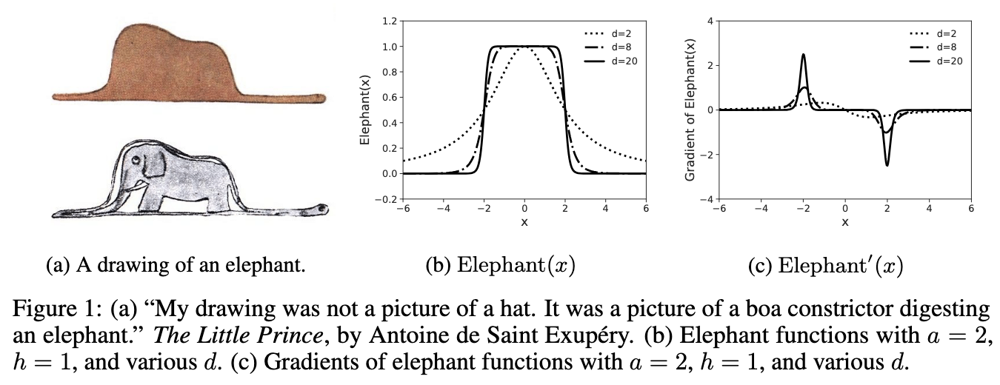
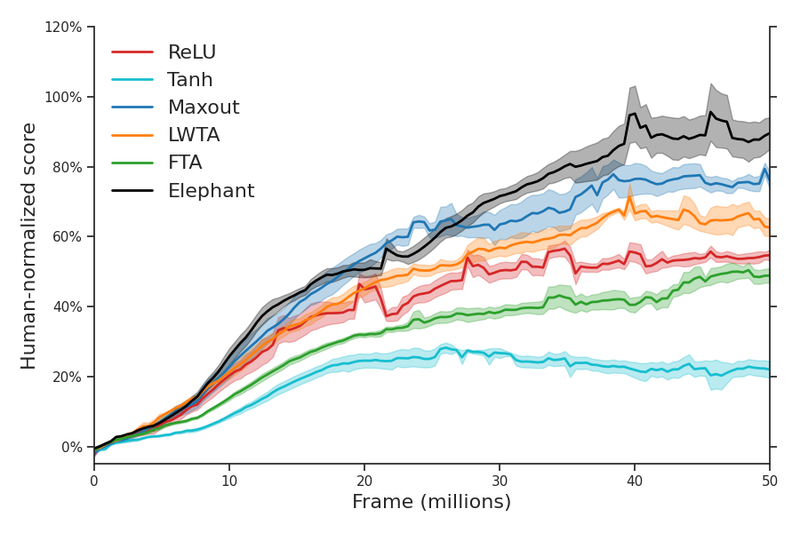

# Elephant Activation Function

This is the official implementation of *elephant activation function*, a new class of activation function that can generates both sparse outputs and sparse gradients, introduced in [Efficient Reinforcement Learning by Reducing Forgetting with Elephant Activation Functions](https://arxiv.org/abs/2509.19159).



We show that by simply replacing classical activation functions with elephant activation functions in the neural networks of value-based reinforcement learning algorithms, we can significantly improve the resilience of neural networks to catastrophic forgetting, thus making reinforcement learning more sample-efficient and memory-efficient.




**Table of Contents**

- [Installation](#installation)
- [Experiment](#experiment)
  - [Training](#training)
  - [Hyperparameter](#hyperparameter)
  - [Analysis](#analysis)
- [Citation](#citation)
- [Acknowledgement](#acknowledgement)


## Installation

- [Python](https://www.python.org/): ==3.11
- [Jax](https://jax.readthedocs.io/en/latest/installation.html): ==0.4.23
- [PyTorch](https://pytorch.org/get-started/locally/): ==2.0.1
- [MuJoCo](https://github.com/google-deepmind/mujoco): ==2.3.6
- [Gymnasium](https://github.com/Farama-Foundation/Gymnasium): `pip install 'gymnasium[box2d,mujoco]==0.29.1'`
- [Gym Games](https://github.com/qlan3/gym-games): >=2.0.0.
- Others: `pip install -r requirements.txt`.


## Experiment

### Training

All hyperparameters including parameters for grid search are stored in a configuration file in directory `configs`. To run an experiment, a configuration index is first used to generate a configuration dict corresponding to this specific configuration index. Then we run an experiment defined by this configuration dict. All results including log files are saved in directory `logs`. Please refer to the code for details.

For example, run the experiment with configuration file `mc_dqn.json` and configuration index `1`:

``` bash
python main.py --config_file ./configs/mc_dqn.json --config_idx 1
```

### Hyperparameter

First, we calculate the number of total combinations in a configuration file (e.g. `mc_dqn.json`):

``` bash
python utils/sweeper.py
```

The output will be:

`Number of total combinations in mc_dqn.json: 240`

Then we run through all configuration indexes from `1` to `240`. The simplest way is using a bash script:

``` bash
for index in {1..240}
do
  python main.py --config_file ./configs/mc_dqn.json --config_idx $index
done
```

[Parallel](https://www.gnu.org/software/parallel/) is usually a better choice to schedule a large number of jobs:

``` bash
parallel --eta --ungroup python main.py --config_file ./configs/mc_dqn.json --config_idx {1} ::: $(seq 1 240)
```

Any configuration index that has the same remainder (divided by the number of total combinations) should have the same configuration dict. So for multiple runs, we just need to add the number of total combinations to the configuration index. For example, 3 runs for configuration index `1`:

``` bash
for index in 1 241 481
do
  python main.py --config_file ./configs/mc_dqn.json --config_idx $index
done
```

Or a simpler way:
``` bash
parallel --eta --ungroup python main.py --config_file ./configs/mc_dqn.json --config_idx {1} ::: $(seq 1 240 720)
```

To replicate the results in the papar, simply run
``` bash
bash run.sh
```

### Analysis

To analyze the experimental results, just run:

`python analysis/*.py`

Inside `analysis/*.py`, `unfinished_index` will print out the configuration indexes of unfinished jobs based on the existence of the result file. `memory_info` will print out the memory usage information and generate a histogram to show the distribution of memory usages in directory `logs/mc_dqn/0`. Similarly, `time_info` will print out the time information and generate a histogram to show the distribution of time in directory `logs/mc_dqn/0`. Finally, `analyze` will generate `csv` files that store training and test results. Please check folder `analysis` for more details. More functions are available in `utils/plotter.py`.


## Citation

If you find this work useful to your research, please cite our paper.

```bibtex
@article{lan2025efficient,
  title={Efficient Reinforcement Learning by Reducing Forgetting with Elephant Activation Functions},
  author={Lan, Qingfeng and Vasan, Gautham and Mahmood, A. Rupam},
  journal={arXiv preprint arXiv:2509.19159},
  year={2025}
}
```


# Acknowledgement

- [Jax RL](https://github.com/ikostrikov/jaxrl)
- [CleanRL](https://github.com/vwxyzjn/cleanrl)
- [PureJaxRL](https://github.com/luchris429/purejaxrl)
- [rl-basics](https://github.com/vcharraut/rl-basics)
- [Tianshou](https://github.com/thu-ml/tianshou)